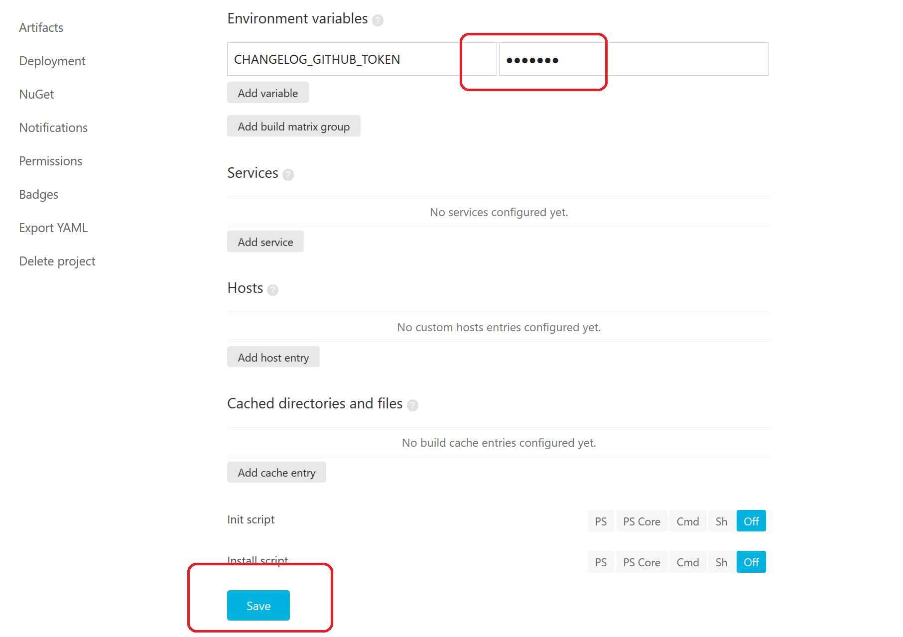

# sakura editor の ChangeLog を生成するためのリポジトリです。

[](https://ci.appveyor.com/project/sakuraeditor/changelog-sakura/branch/master)

このリポジトリは [サクラエディタ](https://github.com/sakura-editor/sakura) の Issue や Pull Request などの情報を元に外部ツールを使って 自動的に Markdown の形式で ChangeLog を生成するためのプロジェクトです。

どのようなオプション(除外するタグなど)を外部ツールに渡して markdown の生成を行うかは検討中です。
何か提案等あれば issue への登録をお願いします。

## 生成した `CHANGELOG.md` のダウンロードおよびローカルの確認

### ダウンロード先

appveyor で生成した `CHANGELOG.md` は以下からダウンロードできます。

https://ci.appveyor.com/project/sakuraeditor/changelog-sakura/build/artifacts 

### ダウンロードした `CHANGELOG.md` の確認方法

`CHANGELOG.md` は [Visual Studio Code](https://code.visualstudio.com/) をインストールした上で [Markdown Preview Github Styling](https://marketplace.visualstudio.com/items?itemName=bierner.markdown-preview-github-styles) をインストールしてプレビュー表示することで
GitHub で見るのと同様の見た目で内容を確認できます。

## ChangeLog の生成方法

[github_changelog_generator](https://github.com/github-changelog-generator/github-changelog-generator) を
使用してChangeLog を生成します。

### github_changelog_generator の使い方のドキュメント

https://github.com/github-changelog-generator/github-changelog-generator#usage

## GitHub Access Token

### GitHub Access Token に関して

github_changelog_generator は GitHub API を使用して GitHub から情報を取得して自動的に ChangeLog を生成します。
GitHub API は匿名アクセスの場合、一時間あたり 60 リクエストという制限があります。Access Token を使用することで
一時間あたり 5000 リクエストに拡大することができます。

https://developer.github.com/v3/#rate-limiting

サクラエディタでは、匿名アクセスの制限では足りないので、制限を緩和するために Access Token を使用します。

### GitHub Access Token の作成方法

**注意: この GitHub Access Token はアカウント名とパスワードをあわせたものと同等なので誤って漏れないように注意してください。**

1. https://github.com/settings/tokens/new にアクセスします。
2. 以下画面で、`Token description` にわかり易い名前をつけた上で、`repo` の `public_repo` にチェックを付けて、`Generate token` を押します。(`repo` 全体にチェックをつける必要はありません。)
   
3. Access Token が生成されるのでクリップボードにコピーします。


## github_changelog_generator のインストール

Ruby が利用可能な環境で以下を実行します。

```
installLog.bat
```

あるいは

```
gem install github_changelog_generator
```

installLog.bat は Ruby 2.5 を想定していますが、PATH を通せば他のバージョンでも構いません。

## github_changelog_generator の実行

### GitHub Access Token の設定

github_changelog_generator のインストールをしたあとに GitHub Access Token を環境変数に設定します。XXXX の部分は生成した Access Token です。

```
set CHANGELOG_GITHUB_TOKEN=XXXXX
```

### 実行

以下バッチファイルを実行します。

```
makeChangeLog.bat
```

以下コマンドで `github_changelog_generator` のヘルプが表示されるのでいろんなオプションを確認することができます。

```
github_changelog_generator --help
```

## appveyor での実行

appveyor で実行するときに `CHANGELOG_GITHUB_TOKEN` の環境変数を設定します。
その際、プレーンテキストで appveyor.yml に保存しなくていいように 
appveyor の設定画面で暗号化した上で設定します。

fork リポジトリに対して設定する場合と [sakura-editor organizaion のプロジェクト](https://ci.appveyor.com/project/sakuraeditor/changelog-sakura) で設定する場合で
手順に違いがあります。

1. 設定画面に移動し、`Environment` を選び、`Add variable` を選びます。


2. エディットボックスに `CHANGELOG_GITHUB_TOKEN`と入力して、その右に実際の値を設定します。
3. そして、鍵ボタンを押します。(**重要**)


4. `CHANGELOG_GITHUB_TOKEN` の値が隠れているのを確認して、画面の下までスクロールして `Save`を押します。(**重要**)



5. (sakura-editor organizaion のプロジェクトのみ) [sakura-editor organizaion のプロジェクト](https://ci.appveyor.com/project/sakuraeditor/changelog-sakura) で `Settings` を選び、 `Export YAML` を選ぶと以下の画面になります。


6. (sakura-editor organizaion のプロジェクトのみ) 以下の部分を appveyor.yml にコピーします。

```
environment:
  CHANGELOG_GITHUB_TOKEN:
    secure: buBWtAa04hCnz74nMONW8pZgTY9sx7fdKOPXpTsMs4JoxjWX/LRUBRcmlSjpvo1a
```

↑ この値は暗号化されているので値が公開されても問題ない。

7. (sakura-editor organizaion のプロジェクトのみ) appveyor.yml をコミットして push します。

### appveyor での secure 変数

#### 有効となる条件

Pull Request 内では secure 変更は基本的には無効になります。

ただし、`Settings` → `General` の `Enable secure variables in Pull Requests from the same repository only` の設定を有効にした場合
Pull Request の送り元ブランチが、同じリポジトリの場合のみ例外的に secure 変数が有効になります。

**設定変更後、忘れずに Save する必要があります。**


参考: https://github.com/appveyor/ci/issues/2355#issuecomment-390803634

#### 有効か判定するロジック

|条件|APPVEYOR_REPO_NAME|APPVEYOR_PULL_REQUEST_HEAD_REPO_NAME|secure 変数|処理実行の可否|
|--|--|--|--|--|
|ローカルビルド|空|空 (※1)|-|○|
|ブランチの appveyor ビルドの場合 (Fork)|xxx/changelog-sakura|空 (※1)|○ (UI で設定した場合)|○|
|ブランチの appveyor ビルドの場合 (sakura-editor)|sakura-editor/changelog-sakura|空 (※1)|○|○|
|PR (送信元: Fork のブランチ)|sakura-editor/changelog-sakura|xxx/changelog-sakura|×|×|
|PR (送信元: sakura-editor のブランチ)|sakura-editor/changelog-sakura|sakura-editor/changelog-sakura (※2)|○|○|

→ つまり、以下のいずれかの場合には `CHANGELOG_GITHUB_TOKEN` の変数が利用可能であり、空であればエラーとすればよい。

- `APPVEYOR_PULL_REQUEST_HEAD_REPO_NAME` が空の場合 (※1)
- (上記は当てはまらなくて) `APPVEYOR_REPO_NAME` と `APPVEYOR_PULL_REQUEST_HEAD_REPO_NAME` の値が等しい場合 (※2)
