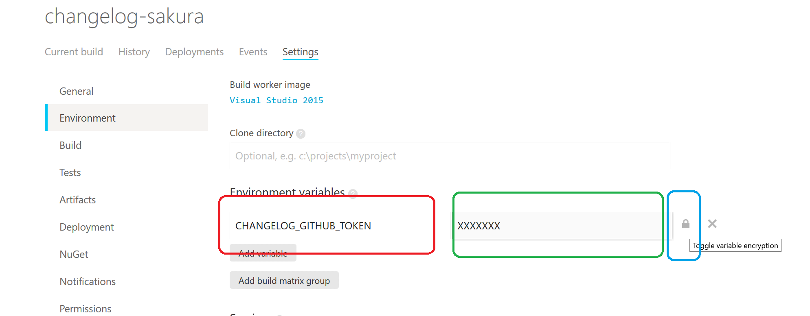
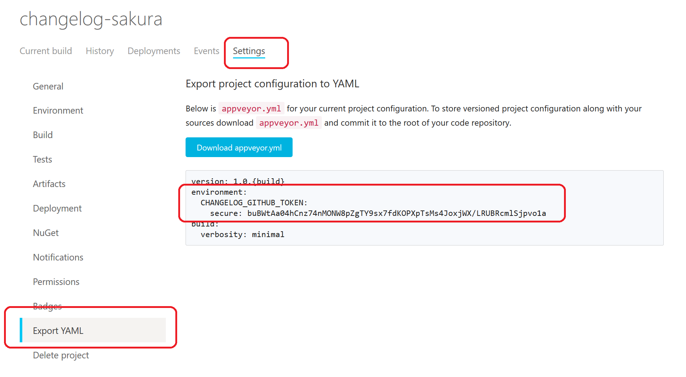
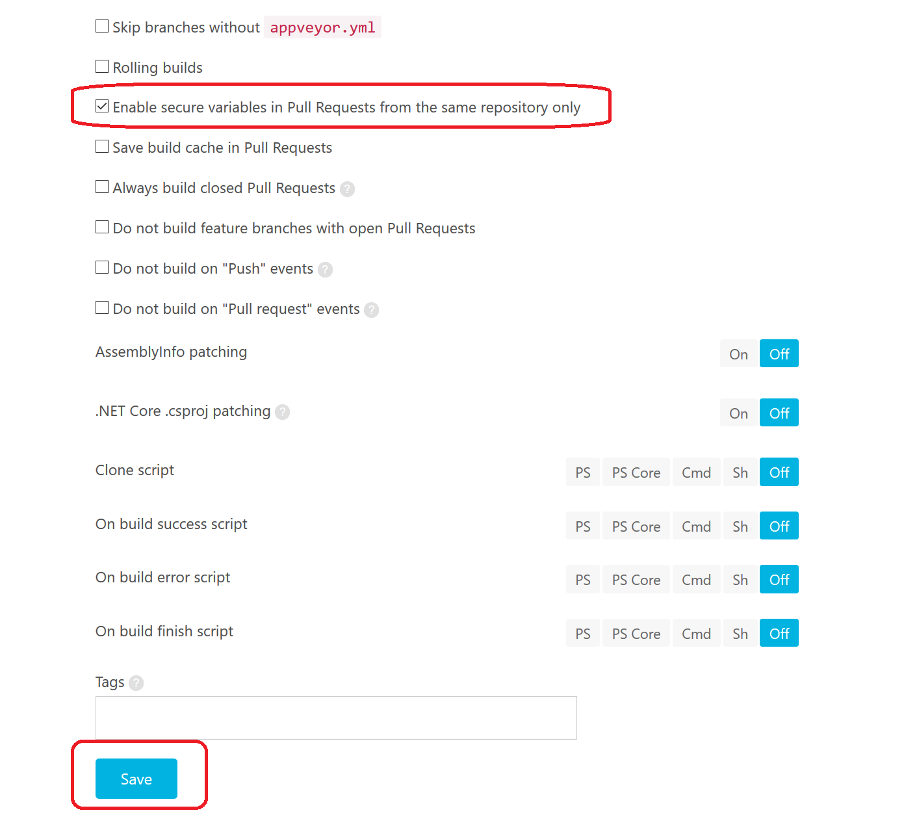

# appveyor の設定方法

[](https://ci.appveyor.com/project/sakuraeditor/changelog-sakura/branch/master)

<!-- TOC -->

- [appveyor の設定方法](#appveyor-の設定方法)
    - [appveyor での実行](#appveyor-での実行)
        - [appveyor での secure 変数](#appveyor-での-secure-変数)
            - [有効となる条件](#有効となる条件)
            - [有効か判定するロジック](#有効か判定するロジック)

<!-- /TOC -->

## appveyor での実行

appveyor で実行するときに `CHANGELOG_GITHUB_TOKEN` の環境変数を設定します。
その際、プレーンテキストで appveyor.yml に保存しなくていいように 
appveyor の設定画面で暗号化した上で設定します。

fork リポジトリに対して設定する場合と [sakura-editor organizaion のプロジェクト](https://ci.appveyor.com/project/sakuraeditor/changelog-sakura) で設定する場合で
手順に違いがあります。

1. 設定画面に移動し、`Environment` を選び、`Add variable` を選びます。


2. エディットボックスに `CHANGELOG_GITHUB_TOKEN`と入力して、その右に実際の値を設定します。
3. そして、鍵ボタンを押します。(**重要**)



4. `CHANGELOG_GITHUB_TOKEN` の値が隠れているのを確認して、画面の下までスクロールして `Save`を押します。(**重要**)


5. (sakura-editor organizaion のプロジェクトのみ) [sakura-editor organizaion のプロジェクト](https://ci.appveyor.com/project/sakuraeditor/changelog-sakura) で `Settings` を選び、 `Export YAML` を選ぶと以下の画面になります。



6. (sakura-editor organizaion のプロジェクトのみ) 以下の部分を appveyor.yml にコピーします。

```
environment:
  CHANGELOG_GITHUB_TOKEN:
    secure: buBWtAa04hCnz74nMONW8pZgTY9sx7fdKOPXpTsMs4JoxjWX/LRUBRcmlSjpvo1a
```

↑ この値は暗号化されているので値が公開されても問題ない。

7. (sakura-editor organizaion のプロジェクトのみ) appveyor.yml をコミットして push します。

### appveyor での secure 変数

#### 有効となる条件

Pull Request 内では secure 変更は基本的には無効になります。

ただし、`Settings` → `General` の `Enable secure variables in Pull Requests from the same repository only` の設定を有効にした場合
Pull Request の送り元ブランチが、同じリポジトリの場合のみ例外的に secure 変数が有効になります。

**設定変更後、忘れずに Save する必要があります。**



参考: https://github.com/appveyor/ci/issues/2355#issuecomment-390803634

#### 有効か判定するロジック

|条件|APPVEYOR_REPO_NAME|APPVEYOR_PULL_REQUEST_HEAD_REPO_NAME|secure 変数|処理実行の可否|
|--|--|--|--|--|
|ローカルビルド|空|空 (※1)|-|○|
|ブランチの appveyor ビルドの場合 (Fork)|xxx/changelog-sakura|空 (※1)|○ (UI で設定した場合)|○|
|ブランチの appveyor ビルドの場合 (sakura-editor)|sakura-editor/changelog-sakura|空 (※1)|○|○|
|PR (送信元: Fork のブランチ)|sakura-editor/changelog-sakura|xxx/changelog-sakura|×|×|
|PR (送信元: sakura-editor のブランチ)|sakura-editor/changelog-sakura|sakura-editor/changelog-sakura (※2)|○|○|

→ つまり、以下のいずれかの場合には `CHANGELOG_GITHUB_TOKEN` の変数が利用可能であり、空であればエラーとすればよい。

- `APPVEYOR_PULL_REQUEST_HEAD_REPO_NAME` が空の場合 (※1)
- (上記は当てはまらなくて) `APPVEYOR_REPO_NAME` と `APPVEYOR_PULL_REQUEST_HEAD_REPO_NAME` の値が等しい場合 (※2)
